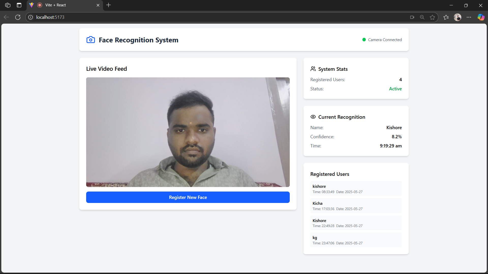

# Face Recognition Platform with Real-Time AI Q&A using RAG

## 🚀 Objective

It is a browser-based platform to:
- Register and recognize faces in real-time using webcam streams.
- Support multi-face detection and live recognition.
- Answer user queries through a chat interface powered by RAG using OpenAI's GPT models.


## 📦 Features

- 👤 Face Registration

- 🎥 Live Face Recognition

- 💬 Chat-Based AI Q&A

## 🖼️ Demo Screenshot

Here’s a preview of the platform in action:



## 🧰 Tech Stack

| Module           | Technology                        |
|------------------|-----------------------------------|
| Frontend         | React.js                          |
| Backend API      | Flask Web Server                  |
| Face Recognition | Python                            | 
| RAG Engine       | Python + LangChain + FAISS + LLM  |
| LLM              | OpenAI ChatGPT (via API)          |

---

## 🔧 Setup Instructions

### 1. Clone the Repo
```bash
git clone https://github.com/your-username/face-recognition-rag-platform.git
cd face-recognition-rag-platform
```

### 2.Frontend
```bash
cd face_reg
npm install
npm run dev
```

### 3.Backend
```bash
pip install -r requirements.txt
python api_server.py
```
---
## 🤝 Contributing
Want to improve or extend this tool?
Feel free to fork the repo, make changes, and submit a pull request. Contributions are welcome!

## 📬 Connect with Me
If you like this project or want to collaborate, feel free to reach out!

📧 Email: kicha2003e@gmail.com

💼 LinkedIn: [Join my network](www.linkedin.com/in/kishore-thedeveloper)

🐙 GitHub: [Profile Link](https://github.com/Kishore003E)

---

### This project is a part of a hackathon run by https://katomaran.com 
